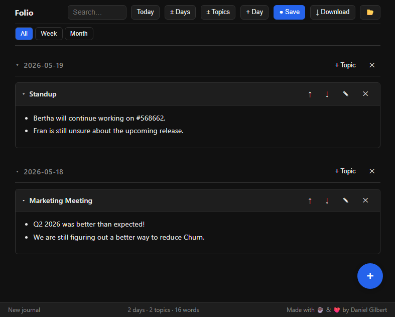

# Folio
This is _Folio_, a frontend for my custom "Journal.md". It is tailored to my needs, and might not work for your needs. However, it is a nice little experiment.



## How does it work?
_Folio_ uses the [File System API](https://developer.mozilla.org/en-US/docs/Web/API/File_System_API)'s [File System Access](https://wicg.github.io/file-system-access/)-Extension of modern Chrome-based Browsers. This means that the code can directly write to a file on your file system, if you opened it via the browser before. If that is not available, it will fall back to a normal "Upload"/"Download"-Routine. It uses plain HTML, CSS and [marked.js](https://marked.js.org) to do the conversion from markdown to HTML.

You can download the repository, and double click on _folio.html_. _marked.js_ is embedded directly into the file, so no Internet connection is required — _folio.html_ is fully self-contained.

## How does the Jounal.md look like?
```
# 2026-05-15
## Topic 1
Some important stuff!
## Topic 2
More important stuff!

# 2026-05-14
## Topic 3
```

The nice thing about this layout: I can edit it in any editor if needed. And I just add information on top.

## Inspiration
I got inspired by [tiddlywiki](https://tiddlywiki.com) which started as a wiki contained in a single HTML file. You would edit the HTML file itself, and all the functionality and logic would be self contained. As I prefer Markdown, I wrote a small interface to edit a Markdown journal.